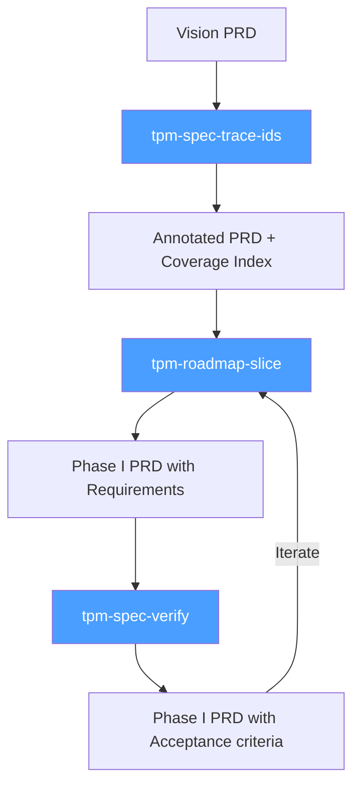

# Claude Code Skills Collection

A growing collection of AI agent skills for software development workflows. Built for technical leads, TPMs, and developers who want Claude Code to help with planning, specification, and engineering tasks.

**Contributions welcome!** Found a way to improve a skill or have a new one to add? [Open a PR](#contributing).

## Available Skills

### TPM & Planning

Transform vision documents into traceable, testable specifications. See the [TPM Planning Guide](docs/tpm-planning/README.md) for the full methodology.

| Skill | Description | Triggers |
|-------|-------------|----------|
| [tpm-spec-trace-ids](skills/tpm-spec-trace-ids/) | Annotate vision docs with Feature IDs (F-nnn) | "annotate my vision doc," "add feature IDs," "create coverage index" |
| [tpm-roadmap-slice](skills/tpm-roadmap-slice/) | Extract features into Phase PRDs with requirements | "create phase PRD," "plan next quarter," "extract phase from vision" |
| [tpm-spec-verify](skills/tpm-spec-verify/) | Add QA requirements and acceptance criteria | "add QA plan," "add acceptance criteria," "enrich with test criteria" |

#### Documentation

- [TPM Planning Guide](docs/tpm-planning/README.md) — Full methodology for the planning pipeline

**Planning Pipeline:**



<!--
### DevOps & Infrastructure
Coming soon.

### Other Categories
Add new categories here as the collection grows.
-->

## Self-Improvement & Loop Analytics

Track and optimize autonomous Claude Code session performance with metrics, trend analysis, and improvement tracking.

| Skill | Description | Use When |
|-------|-------------|----------|
| [self-improvement](self-improvement/) | Analyze session efficiency, track improvements, view trends | "check loop metrics", "how are sessions doing", "analyze iterations", "loop performance", "session efficiency" |

**Key Features:**
- Dashboard with recent sessions, trends, and target comparison
- Deep analysis with automatic trend comparison to previous runs
- Improvement tracking (add, fix, search, list) with severity levels
- JSONL session log parsing and bulk backfill
- Efficiency targets: completion rate, narration-only turns, parallel tool calls, turns per session
- SQLite-backed persistence with auto-created schema

## Web Development & UI Components

Build accessible, production-ready autocomplete, token inputs, and filter query builders using proven patterns from Downshift, Headless UI, and tools like Datadog and Linear.

| Skill | Description | Use When |
|-------|-------------|----------|
| [webdev-combobox-autocomplete](webdev-combobox-autocomplete/) | Foundational autocomplete/combobox patterns with ARIA, keyboard nav, async suggestions | Building autocomplete, command palettes, search inputs, select replacements |
| [webdev-token-input](webdev-token-input/) | Multi-value token/chip inputs with key:value parsing | Building filter bars, tag inputs, email "To" fields, multi-select chips |
| [webdev-filter-query-builder](webdev-filter-query-builder/) | Advanced filter query construction with AST, operators, serialization | Building observability tools, data analytics, search interfaces with boolean logic |

**Key Features:**
- State model patterns (highlightedIndex, virtual focus, token management)
- ARIA combobox pattern with `aria-activedescendant`
- Keyboard navigation (arrows, Enter, Escape, Tab, Backspace)
- Prop-getter pattern for framework-agnostic implementation
- Async suggestions with race condition prevention
- Focus management solutions (blur vs click-outside, cursor jumping)
- Context-dependent suggestions and caching
- Filter AST representation and query serialization

## Webcomic - comic-strip-pipeline

Go from a script or story to a prepared script ready for nano-banana or another image generator.

```bash
/plugin marketplace add https://github.com/ozten/skills
/plugin install comic-strip-pipeline@skills
```

### Example usage:

During a claude code session:

```bash
/comic-strip-pipeline:create-comic Please take `outputs/2026-01-29_07-05-38_building-in-public-is.script.md` and identify the best comic strip lurking in their. Characters
  to choose from are `character_sheets/character_sheets.md` and ideally the setting is `character_sheets/setting.md`, but choose another setting if needed.
```


## Skill Installation

### Option 1: CLI Install (Recommended)

Use [add-skill](https://github.com/vercel-labs/add-skill) to install skills directly:

```bash
# Install all skills
npx skills add https://github.com/ozten/skills

# Install specific skills
npx skills add https://github.com/ozten/skills --skill tpm-spec-trace-ids

# List available skills
npx skills add https://github.com/ozten/skills --list
```

### Option 2: Clone and Copy

Clone the repo and copy the skills you need:

```bash
git clone https://github.com/ozten/skills
cp -r skills/* ~/.claude/skills/
```

### Option 3: Direct Download

Download individual `SKILL.md` files and place them in `~/.claude/skills/skill-name/`.

### Option 4: Fork and Customize

1. Fork this repository
2. Customize skills for your team's workflows
3. Clone your fork into your projects

## Usage

Once installed, just ask Claude Code to help with tasks:

**Planning tasks:**
```
"Annotate this vision doc with feature IDs"
→ Uses tpm-spec-trace-ids skill

"Create a phase PRD for Q2"
→ Uses tpm-roadmap-slice skill

"Add acceptance criteria to this spec"
→ Uses tpm-spec-verify skill
```

**Web development tasks:**
```
"Build an autocomplete search input with keyboard navigation"
→ Uses webdev-combobox-autocomplete skill

"Create a tag input with token chips like Linear's filters"
→ Uses webdev-token-input skill

"Build a filter query builder with operators and date ranges"
→ Uses webdev-filter-query-builder skill
```

**Loop analytics tasks:**
```
"Check my loop metrics"
→ Uses self-improvement skill

"Analyze the last 20 iterations"
→ Uses self-improvement skill

"Add an improvement for high narration rate"
→ Uses self-improvement skill
```

Or reference skills directly when starting a task:

```
"Using tpm-roadmap-slice, extract features F-012 through F-018 into a phase PRD"

"Using webdev-combobox-autocomplete, build a command palette with async suggestions"
```

## Contributing

Found a way to improve a skill? Have a new skill to suggest? PRs and issues welcome!

**Ideas for contributions:**
- Improve existing skill instructions or workflows
- Add new skills for other domains (DevOps, security, testing)
- Fix typos or clarify confusing sections
- Add examples or templates

**How to contribute:**
1. Fork the repo
2. Create or edit skill files
3. Submit a PR with a clear description

### What are Skills?

Skills are markdown files that give AI agents specialized knowledge and workflows for specific tasks. When you add these to your project, Claude Code can recognize what you're working on and apply the right frameworks and best practices.

### Skill File Structure

Each skill is a directory containing a `SKILL.md` file:

```
skills/
  skill-name/
    SKILL.md
    assets/           # Optional templates
    references/       # Optional detailed docs
```

See [Claude Skills](https://code.claude.com/docs/en/skills) for details.

---

# Skill Name

[Full instructions for the AI agent]
```

## License

MIT — Use these however you want.