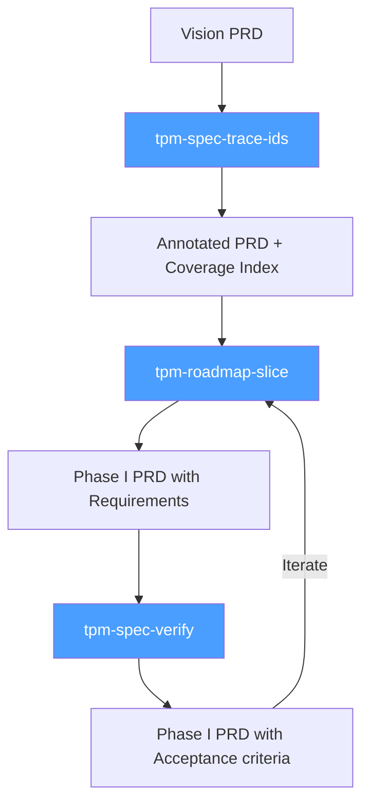
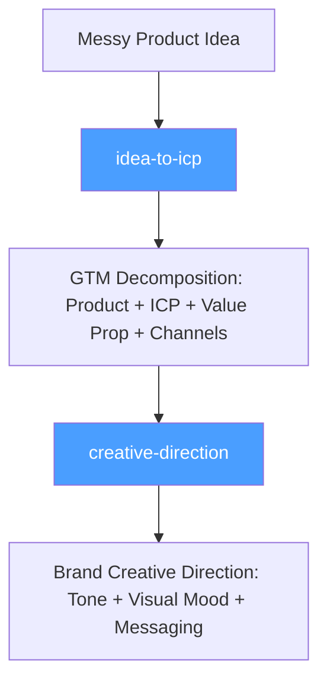
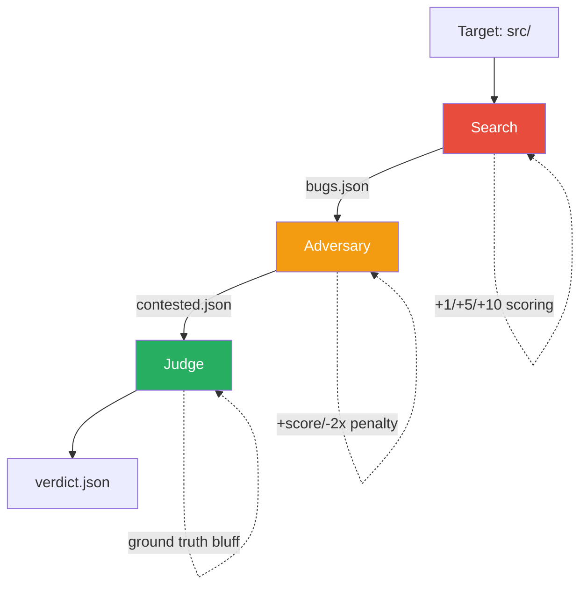

# Claude Code Skills Collection

A growing collection of AI agent skills for software development workflows. Built for technical leads, TPMs, and developers who want Claude Code to help with planning, specification, and engineering tasks.

**Contributions welcome!** Found a way to improve a skill or have a new one to add? [Open a PR](#contributing).

## Available Skills

### TPM & Planning

Transform vision documents into traceable, testable specifications. See the [TPM Planning Guide](docs/tpm-planning/README.md) for the full methodology.

| Skill | Description | Triggers |
|-------|-------------|----------|
| [tpm-spec-trace-ids](skills/tpm-spec-trace-ids/) | Annotate vision docs with Feature IDs (F-nnn) | "annotate my vision doc," "add feature IDs," "create coverage index" |
| [tpm-roadmap-slice](skills/tpm-roadmap-slice/) | Extract features into Phase PRDs with requirements | "create phase PRD," "plan next quarter," "extract phase from vision" |
| [tpm-spec-verify](skills/tpm-spec-verify/) | Add QA requirements and acceptance criteria | "add QA plan," "add acceptance criteria," "enrich with test criteria" |

#### Documentation

- [TPM Planning Guide](docs/tpm-planning/README.md) — Full methodology for the planning pipeline

**Planning Pipeline:**



<!--
### DevOps & Infrastructure
Coming soon.

### Other Categories
Add new categories here as the collection grows.
-->

## Product & Strategy

Tools for auditing and simplifying ideas, products, and systems.

| Skill | Description | Use When |
|-------|-------------|----------|
| [simplify](simplify/) | Radical Simplicity & Candor Audit | Asking for advice on radically simplifying an idea, product, architecture, or system |

The simplify skill produces structured audit reports with phased YES/NO/DEFER decision lists. It exposes complexity and prepares batched decisions—it does not execute changes.

## GTM & Strategy

Go from a messy product idea to a structured go-to-market plan, then develop brand creative direction — all driven by structured workflows with phase gates and opinionated defaults.

| Skill | Description | Use When |
|-------|-------------|----------|
| [idea-to-icp](idea-to-icp/) | Take a messy business idea and structure it into GTM primitives: Product, ICP segments, value prop, beachhead market, and channel strategy | "decompose my idea", "help me find my ICP", "who should I sell to", "idea to ICP", "structure my go-to-market" |
| [creative-direction](creative-direction/) | Develop 3-5 distinct brand creative treatments from GTM data — tone, visual mood, messaging, and taglines | "creative direction", "brand treatments", "brand tone", "creative brief", "brand identity direction" |

**GTM Pipeline:**



## Code Quality & Bug Detection

Adversarial multi-agent systems for finding bugs with high confidence.

| Skill | Description | Use When |
|-------|-------------|----------|
| [find-bugs](find-bugs/) | Three-agent adversarial bug review (search → adversary → judge) | "find bugs", "review code for bugs", "adversarial code review" |

**Find Bugs Pipeline:**



The pipeline exploits asymmetric incentives to produce three distinct epistemic postures:
- **Search**: Overclaiming (rewards thoroughness)
- **Adversary**: Aggressive skepticism (rewards precise disproval)
- **Judge**: Calibrated judgment (rewards accuracy)

Their intersection yields high-fidelity results with reduced false positives.

**Usage:**
```bash
/find-bugs src/
```

**Output:**
```
.find-bugs/
├── bugs.json          # All potential bugs found
├── contested.json     # Adversary's challenges
└── verdict.json       # Final calibrated verdicts
```

## Self-Improvement & Analysis

Tools for root cause analysis, retrospectives, and optimizing autonomous session performance.

| Skill | Description | Use When |
|-------|-------------|----------|
| [five-whys](five-whys/) | Root cause analysis via iterative "Why?" questions | Analyzing failures, post-mortems, retrospectives, debugging repeated mistakes, reflecting on what went wrong |
| [self-improvement](self-improvement/) | Analyze session efficiency, track improvements, view trends | "check loop metrics", "how are sessions doing", "analyze iterations", "loop performance", "session efficiency" |

**Prerequisites:** This skill is built for projects using an autonomous loop setup:
- **ralph-wiggum loop** — A bash script that runs Claude Code headlessly in batches, saving each session transcript as `claude-iteration-N.jsonl` (via `--output-format stream-json`). Handles rate-limit backoff, zombie task cleanup, and performance feedback injection between iterations.
- **Beads (`bd`)** — A git-native CLI issue tracker (`.beads/issues.jsonl`). The parser detects `bd update`, `bd-finish.sh`, and `bd close` commands to determine task attribution and commit success.

Without these, the improvement tracker (`improvement add/list/fix/search`) still works standalone.

**Key Features:**
- Dashboard with recent sessions, trends, and target comparison
- Deep analysis with automatic trend comparison to previous runs
- Improvement tracking (add, fix, search, list) with severity levels
- Parses `claude-iteration-N.jsonl` session transcripts produced by the ralph-wiggum loop
- Efficiency targets: completion rate, narration-only turns, parallel tool calls, turns per session
- SQLite-backed persistence with auto-created schema

## Web Development & UI Components

Build accessible, production-ready autocomplete, token inputs, and filter query builders using proven patterns from Downshift, Headless UI, and tools like Datadog and Linear.

| Skill | Description | Use When |
|-------|-------------|----------|
| [webdev-combobox-autocomplete](webdev-combobox-autocomplete/) | Foundational autocomplete/combobox patterns with ARIA, keyboard nav, async suggestions | Building autocomplete, command palettes, search inputs, select replacements |
| [webdev-token-input](webdev-token-input/) | Multi-value token/chip inputs with key:value parsing | Building filter bars, tag inputs, email "To" fields, multi-select chips |
| [webdev-filter-query-builder](webdev-filter-query-builder/) | Advanced filter query construction with AST, operators, serialization | Building observability tools, data analytics, search interfaces with boolean logic |

**Key Features:**
- State model patterns (highlightedIndex, virtual focus, token management)
- ARIA combobox pattern with `aria-activedescendant`
- Keyboard navigation (arrows, Enter, Escape, Tab, Backspace)
- Prop-getter pattern for framework-agnostic implementation
- Async suggestions with race condition prevention
- Focus management solutions (blur vs click-outside, cursor jumping)
- Context-dependent suggestions and caching
- Filter AST representation and query serialization

## Image Generation - nano-banana-image-gen

Generate images using the [`imagen` CLI](https://github.com/ozten/imagen) — a unified Rust binary for Gemini and OpenAI image models. Supports text prompts, multiple aspect ratios, resolutions, output formats, and batch generation.

| Skill | Description | Use When |
|-------|-------------|----------|
| [nano-banana-image-gen](nano-banana-image-gen/) | Generate images via `imagen` CLI (Gemini + OpenAI) | "nano banana", "generate an image", "draw", "illustrate", "make a picture" |

**Setup:**

```bash
# Install the imagen CLI
curl -fsSL https://raw.githubusercontent.com/ozten/imagen/main/scripts/install.sh | bash

# Configure API keys (env vars or config file)
export GEMINI_API_KEY="your-gemini-api-key"
export OPENAI_API_KEY="your-openai-api-key"

# Or edit ~/.config/imagen/config.toml
```

**Models:** `nano-banana` (Gemini, default), `gpt-1.5`, `gpt-1`, `gpt-1-mini` (OpenAI)

> **Note:** If `imagen` isn't installed when you try to generate an image, the skill will offer to install it for you.

## YouTube Transcript Extraction

Extract transcripts from YouTube videos with zero dependencies — just Node.js 18+.

| Skill | Description | Use When |
|-------|-------------|----------|
| [youtube-transcript](youtube-transcript/) | Extract transcripts from YouTube videos | "get transcript from this video", "what does this YouTube video say", "summarize this YouTube video" |

**Features:**
- Zero npm dependencies — self-contained script
- Uses YouTube's Innertube API (fast) with web scraping fallback
- Supports timestamps, JSON output, and language selection
- Works with all YouTube URL formats including Shorts

**Usage:**

```bash
# Plain text transcript
node youtube-transcript/get-transcript.js "https://youtube.com/watch?v=VIDEO_ID"

# With timestamps
node youtube-transcript/get-transcript.js "https://youtu.be/VIDEO_ID" --timestamps

# JSON output
node youtube-transcript/get-transcript.js "https://youtube.com/watch?v=VIDEO_ID" --json

# Save to file
node youtube-transcript/get-transcript.js "https://youtu.be/VIDEO_ID" --save transcript.txt

# Specific language
node youtube-transcript/get-transcript.js "https://youtu.be/VIDEO_ID" --lang es
```

## Webcomic - comic-strip-pipeline

Go from a script or story to a prepared script ready for nano-banana or another image generator.

```bash
/plugin marketplace add https://github.com/ozten/skills
/plugin install comic-strip-pipeline@skills
```

### Example usage:

During a claude code session:

```bash
/comic-strip-pipeline:create-comic Please take `outputs/2026-01-29_07-05-38_building-in-public-is.script.md` and identify the best comic strip lurking in their. Characters
  to choose from are `character_sheets/character_sheets.md` and ideally the setting is `character_sheets/setting.md`, but choose another setting if needed.
```


## Skill Installation

### Option 1: CLI Install (Recommended)

Use [add-skill](https://github.com/vercel-labs/add-skill) to install skills directly:

```bash
# Install all skills
npx skills add https://github.com/ozten/skills

# Install specific skills
npx skills add https://github.com/ozten/skills --skill tpm-spec-trace-ids

# List available skills
npx skills add https://github.com/ozten/skills --list
```

### Option 2: Clone and Copy

Clone the repo and copy the skills you need:

```bash
git clone https://github.com/ozten/skills
cp -r skills/* ~/.claude/skills/
```

### Option 3: Direct Download

Download individual `SKILL.md` files and place them in `~/.claude/skills/skill-name/`.

### Option 4: Fork and Customize

1. Fork this repository
2. Customize skills for your team's workflows
3. Clone your fork into your projects

## Usage

Once installed, just ask Claude Code to help with tasks:

**Planning tasks:**
```
"Annotate this vision doc with feature IDs"
→ Uses tpm-spec-trace-ids skill

"Create a phase PRD for Q2"
→ Uses tpm-roadmap-slice skill

"Add acceptance criteria to this spec"
→ Uses tpm-spec-verify skill
```

**Web development tasks:**
```
"Build an autocomplete search input with keyboard navigation"
→ Uses webdev-combobox-autocomplete skill

"Create a tag input with token chips like Linear's filters"
→ Uses webdev-token-input skill

"Build a filter query builder with operators and date ranges"
→ Uses webdev-filter-query-builder skill
```

**Product & strategy tasks:**
```
"Help me radically simplify this product idea"
→ Uses simplify skill

"Give me advice on simplifying this architecture"
→ Uses simplify skill
```

**GTM & strategy tasks:**
```
"I have an idea for a property management tool for small landlords"
→ Uses idea-to-icp skill

"Decompose my idea into ICP segments and channels"
→ Uses idea-to-icp skill

"Create brand creative direction from my GTM doc"
→ Uses creative-direction skill

"Give me brand treatments for my product"
→ Uses creative-direction skill
```

**Image generation tasks:**
```
"Generate an image of a cat in a spacesuit"
→ Uses nano-banana-image-gen skill

"Nano banana: cyberpunk cityscape at sunset"
→ Uses nano-banana-image-gen skill

"Draw a watercolor mountain landscape using gpt-1.5"
→ Uses nano-banana-image-gen skill
```

**Self-improvement & analysis tasks:**
```
"Why did that deploy fail? Let's do a 5 whys analysis"
→ Uses five-whys skill

"Help me figure out the root cause of this bug recurring"
→ Uses five-whys skill

"Run /find-bugs on src/"
→ Uses find-bugs skill

"/find-bugs src/auth/"
→ Uses find-bugs skill

"Check my loop metrics"
→ Uses self-improvement skill

"Analyze the last 20 iterations"
→ Uses self-improvement skill
```

**YouTube transcript tasks:**
```
"Get the transcript from this YouTube video"
→ Uses youtube-transcript skill

"Summarize this YouTube video: https://youtube.com/watch?v=xyz"
→ Uses youtube-transcript skill
```

Or reference skills directly when starting a task:

```
"Using tpm-roadmap-slice, extract features F-012 through F-018 into a phase PRD"

"Using webdev-combobox-autocomplete, build a command palette with async suggestions"
```

## Contributing

Found a way to improve a skill? Have a new skill to suggest? PRs and issues welcome!

**Ideas for contributions:**
- Improve existing skill instructions or workflows
- Add new skills for other domains (DevOps, security, testing)
- Fix typos or clarify confusing sections
- Add examples or templates

**How to contribute:**
1. Fork the repo
2. Create or edit skill files
3. Submit a PR with a clear description

### What are Skills?

Skills are markdown files that give AI agents specialized knowledge and workflows for specific tasks. When you add these to your project, Claude Code can recognize what you're working on and apply the right frameworks and best practices.

### Skill File Structure

Each skill is a directory containing a `SKILL.md` file:

```
skills/
  skill-name/
    SKILL.md
    assets/           # Optional templates
    references/       # Optional detailed docs
```

See [Claude Skills](https://code.claude.com/docs/en/skills) for details.

---

# Skill Name

[Full instructions for the AI agent]
```

## License

MIT — Use these however you want.
